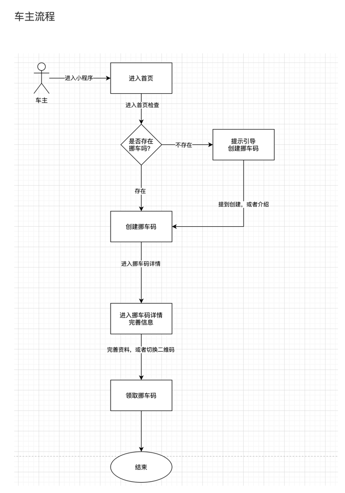
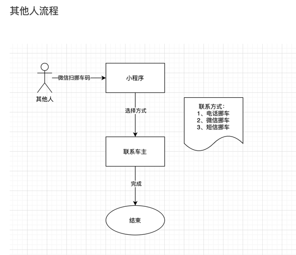
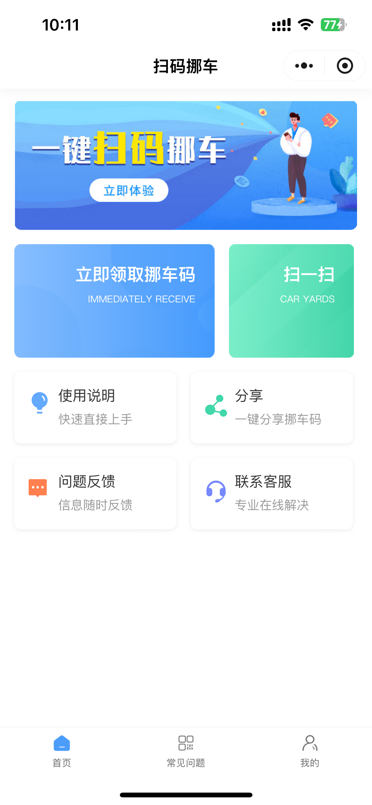
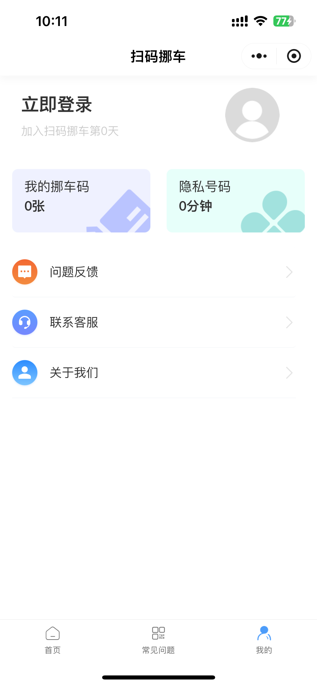
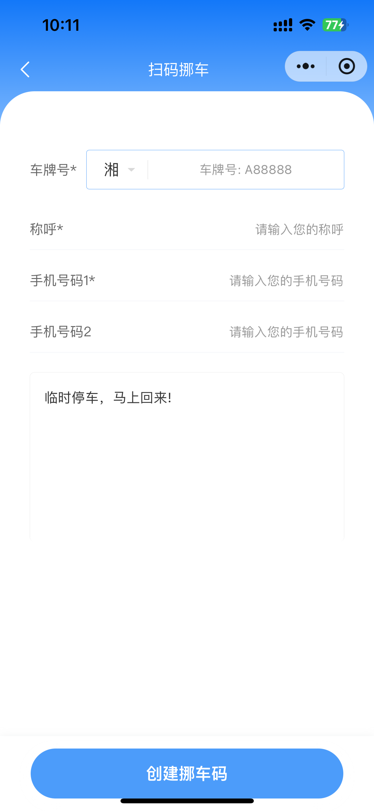

# 扫码挪车 “小程序”

**有需要和定制的小伙伴联系作者个人微信：sin903280167 (Tip: 标准来意哈。)**

## 流程图

## 说明

**一、对车主方便快捷**

- **保护隐私信息**：传统的留电话号码挪车方式可能会导致个人信息泄露，车主可能会收到骚扰电话或短信。而扫码挪车可以很好地解决这个问题。我们对接了 “阿里云” 通过扫码获取虚拟号码，呼叫者只能通过系统转接联系到车主，不会直接看到车主的电话号码，最大程度地保护了车主的隐私。
- **快速响应**：车主在接到挪车通知时可以第一时间收到消息提醒。例如，有些扫码挪车系统会和手机应用关联，当有人扫码请求挪车时，手机会像接收短信或电话一样弹出提醒，方便车主及时发现并处理挪车请求，减少因未能及时发现挪车通知而导致的纠纷。

**二、对请求挪车方便捷高效**

- **操作简单**：对于需要车主挪车的人来说，操作非常简单易懂。只需要用手机扫描车上的二维码，按照系统提示进行操作就可以联系到车主。相比传统的通过拨打 114 或者其他方式寻找车主联系方式的过程，扫码挪车大大节省了时间和精力。
- **实时反馈**：请求挪车方能够及时了解自己的请求是否已经被车主接收。在一些扫码挪车的系统中，会有类似于消息发送成功、对方已读等反馈信息，这样请求挪车的人可以更好地安排自己的等待时间或者下一步行动。
- **停车留言**：若您因急事需要提前离开，可在系统中留下相关信息 。其他车主扫码时，便能第一时间获取您的留言内容，确保双方沟通顺畅、高效。

## UI 展示

## 功能点

以下是 “扫码挪车” 功能点：

| 功能名称                    | 备注                 |
| --------------------------- | -------------------- |
| 注册/登录                   |                      |
| 分享                        |                      |
| 联系客服                    |                      |
| 使用说明                    |                      |
| 问题反馈                    |                      |
| banner                      |                      |
| 创建挪车码                  |                      |
| 扫码挪车                    |                      |
| 隐私号码                    | 对接阿里云           |
| 隐私号码-通话时长充值和计费 |                      |
| 微信扫码跳转小程序          |                      |
| 批量生成二维码              | 拼多多、淘宝... 购卖 |
| 购买的二维码绑定            | 二维码绑定车         |

**Tip: 拥有完整的高质量的代码和产品设计ui设计，有意者联系微信 sin903280167**

